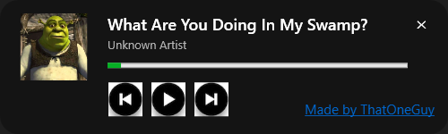

# Spotify Overlay

A modern Spotify desktop overlay built with **C#**, **WPF**, and the **Windows Media Session API**.



## Features

* 🎵 Live Spotify song title
* 🎤 Live artist name
* 🖼️ Album artwork display
* ⏯️ Play / Pause controls
* ⏮️ Previous track control
* ⏭️ Next track control
* 📊 Real-time song progress bar
* 📌 Always-on-top overlay
* 🖱️ Draggable window
* ⌨️ F1–F4 keyboard shortcuts
* 🎨 Modern Spotify-inspired design
* 🔗 Clickable GitHub watermark

## Keyboard Shortcuts

| Key | Action              |
| --- | ------------------- |
| F1  | Previous Track      |
| F2  | Play / Pause        |
| F3  | Next Track          |
| F4  | Hide / Show Overlay |

## Technologies Used

* C#
* WPF (.NET 8)
* Windows Media Session API
* Visual Studio 2022
```

## Installation

### Clone the Repository

```bash
git clone https://github.com/ThatOneGuy-67/SpotifyOverlay.git
```

### Open the Project

Open the solution in:

```text
Visual Studio 2022
```

### Restore Packages

```bash
dotnet restore
```

### Run

Press:

```text
F5
```

or

```bash
dotnet run
```

## Requirements

* Windows 10/11
* .NET 8 SDK
* Spotify Desktop Application

## How It Works

The overlay uses the Windows Media Session API to detect active Spotify sessions and retrieve:

* Song Title
* Artist Name
* Album Art
* Playback State
* Timeline Information

No Spotify Developer Account is required.

## Watermark

A watermark is displayed inside the application.

Clicking:

```text
Made by ThatOneGuy
```

opens the project creator's GitHub profile.

## Future Plans

* Global Hotkeys
* Acrylic Blur Background
* Rounded Album Art Masks
* Theme Customization
* Progress Time Labels
* Volume Controls
* Compact Mode
* Auto Hide While Paused
* Discord Rich Presence Integration

## License

MIT License

Feel free to modify, fork, and improve this project.

---

Made with ❤️ by ThatOneGuy
